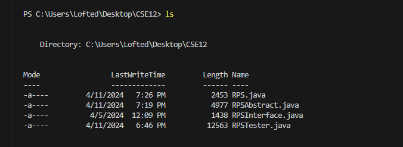

# Lab Report 1

**Commands without arguments:**

CD: 

'cd' absolute path right before the command was run was the wokring directory "C:\Users\Lofted\Desktop\CSE12". I got the same output as before since the command without arguments returns you to the same path you were already in. The output is also **not** an error. 

LS: 

The absolute path before the command was run is C:\Users\Lofted\Desktop\CSE12. The 'ls' command lists the contents of the current directory which here it listed Java source files which is expected from this command meaning it was **not** an error.

CAT: nothing happens since a file path is needed, it is an error 

**Directory Path Argument:**
CD:

LS:

CAT:

**File path argument:**
CD:

LS:

CAT:

