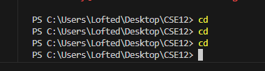
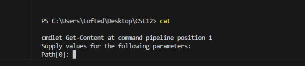
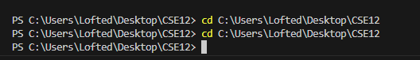
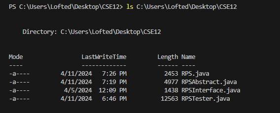
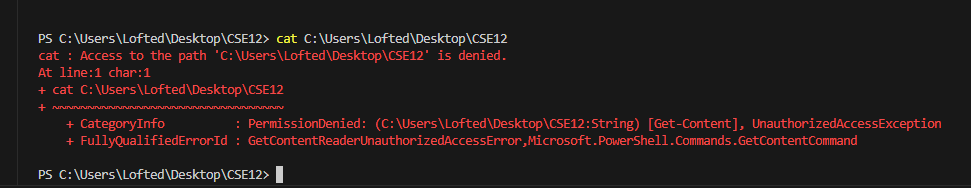
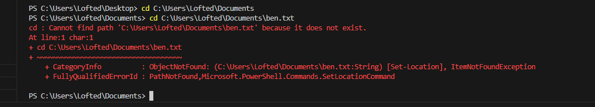
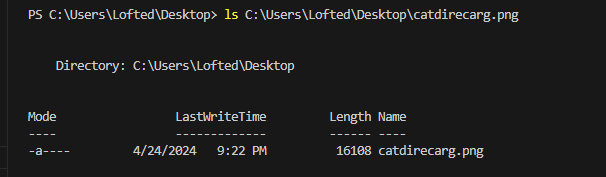
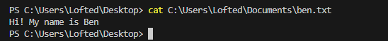

# Lab Report 1

**Commands without arguments:**

CD: 

'cd' absolute path right before the command was run was the wokring directory "C:\Users\Lofted\Desktop\CSE12". I got the same output as before since the command without arguments returns you to the same path you were already in. The output is also **not** an error. 

LS: 

The absolute path before the command was run is C:\Users\Lofted\Desktop\CSE12. The 'ls' command lists the contents of the current directory which here it listed Java source files which is expected from this command meaning it was **not** an error.

CAT: 

The absolute path before the command was run is C:\Users\Lofted\Desktop\CSE12. Since the 'cat' command requires a path argument to function, it is just displaying its content, and this is **not** an error 

**Directory Path Argument:**

CD:

Before running the 'cd' command, the working directory was already C:\Users\Lofted\Desktop\CSE12. The command was redundant because it tried to change to the directory that was already there, so no change occurred and there is **no** error. 

LS:

Before the ls command was run, the working directory was C:\Users\Lofted\Desktop\CSE12. The command lists the contents of that directory. In this case, it listed Java files, which is the expected behavior. It is **not** an error

CAT:

Working directory was C:\Users\Lofted\Desktop\CSE12. The output of this code is an error message indicating that access to the path was denied. This **did** result in some type of error within the command and path because the command was used on a directory and not a file, resulting in a PermissionDenied error.

**File path argument:**

CD:

The working directory was C:\Users\Lofted\Documents. The output is an error which indicates that 'cd' was given a file path (ben.txt), which cannot be navigated. This code **did** result an error because cd only works with directories and not file paths.

LS:

The working directory was C:\Users\Lofted\Desktop. The output is from listing the properties of a specific file, catdirrecarg.png, on the desktop, which is **not** an error but the expected result of using ls with a file path as an argument.

CAT:

The working directory was C:\Users\Lofted\Desktop. The command 'cat' C:\Users\Lofted\Documents\ben.txt displayed the contents of the file ben.txt, meaning that the file exists and the command worked as expected. In this case there is **no** error as the cat command worked as it should have. 
