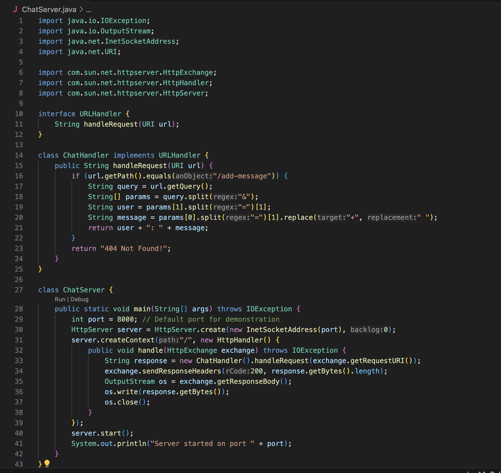
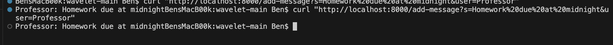
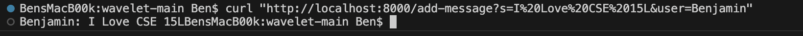
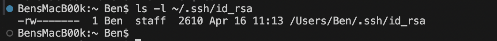
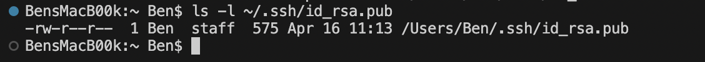
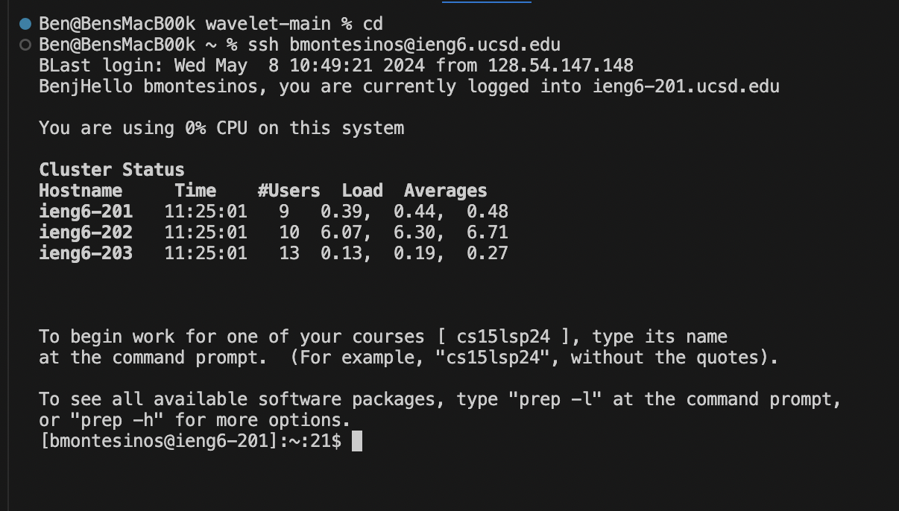

# Lab Report 2

# Part 1

**Chat Server Code**

**Message 1**

**Methods Called:**
The main, handleRequest, and handle methods are called in this code.

**Relevant arguments to methods:**

HttpExchange exchange and URI url are mainly used.

**Field values change**

The String user and String message values are being changed as s= and user= are assigned values. The int port value is also cahnged as it could be assigned a different value such as 500 or 1000. 

Each time a new message is added with the /add-message code, the server updates the chat Log with the username and message inputed. So anything written after "s=" will be the message and anything written after "user=" will be the user that message is coming from. Aditionally, the "%20" indicates spaces in between words for a certain message.

**Message 2**

**Methods Called:**
The main, handleRequest, and handle methods are called in this code.

**Relevant arguments to methods:**

HttpExchange exchange and URI url are mainly used.

**Field values change**

The String user and String message values are being changed as s= and user= are assigned values. The int port value is also cahnged as it could be assigned a different value such as 500 or 1000. 

Each time a new message is added with the /add-message code, the server updates the chat Log with the username and message inputed. So anything written after "s=" will be the message and anything written after "user=" will be the user that message is coming from. Aditionally, the "%20" indicates spaces in between words for a certain message.

# Part 2

**Private Key**

**Public Key**

**Login w/o Password**

# Part 3 

From the lab of this 3rd week of the quarter, I learned that website servers could be made from coding it into a completely different platform. And by using GitHub, you can share and update the code for your server just like you would a Google doc that you share with other peers.
