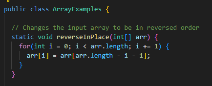
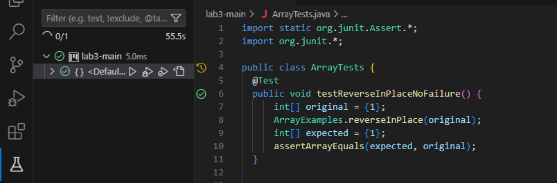
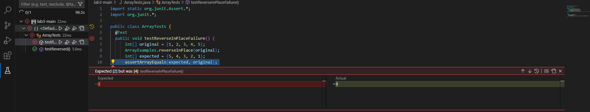

# Lab Report 3

## Part 1 - Bugs

**Chosen Method**





**Failure-inducing Input**

```
public class ArrayTests {
    @Test
    public void testReverseInPlaceFailure() {
        int[] original = {1, 2, 3, 4, 5};
        ArrayExamples.reverseInPlace(original);
        int[] expected = {5, 4, 3, 2, 1};
        assertArrayEquals(expected, original);
    }
}
```
**Non-failure Inducing Input**
```
public class ArrayTests {
    @Test
    public void testReverseInPlaceNoFailure() {
        int[] original = {1};
        ArrayExamples.reverseInPlace(original);
        int[] expected = {1};
        assertArrayEquals(expected, original);
    }
}
```
**Symptom**






**Corrected Code**

```
public static void reverseInPlace(int[] arr) {
    for(int i = 0; i < arr.length / 2; i++) {
        int a = arr[i];
        arr[i] = arr[arr.length - i - 1];
        arr[arr.length - i - 1] = a;
    }
}
```

**Why Fix Works**

The bug is fixed by swapping elements only in the first half of the array which prevents any overwritting. The purpose of the int a array is so that each pair of elements is exchanged only once so that that a index out of bounds error doesn't occur. 


## Part 2 - Researching Commands

### **-i command**
```
BensMacB00k:docsearch-main Ben$ grep -i "weather" ./technical/911report/chapter-1.txt
    For those heading to an airport, weather conditions could not have been better for a safe and pleasant journey. Among the travelers were Mohamed Atta and Abdul Aziz al Omari, who arrived at the airport in Portland, Maine.

BensMacB00k:docsearch-main Ben$ grep -i "snake" ./technical/911report/chapter-12.txt
                the snake," and it must be converted or destroyed.
```

The grep -i command is used here to find the words "weather" and "snake" in text files, ignoring whether they are uppercase or lowercase, making it easy to locate specific terms in large documents.


### **-c command**
```
BensMacB00k:docsearch-main Ben$ grep -c "snake" ./technical/911report/chapter-12.txt
1

BensMacB00k:docsearch-main Ben$ grep -c "plane" ./technical/911report/chapter-1.txt
71
```
This command takes certain key words and lists how many times that word is present in a certain file. It is helpful as it quanitfies references numerically.


### **-v command**
```
BensMacB00k:docsearch-main Ben$ grep -v "a" ./technical/government/Media/5_Legal_Groups.txt
BY EDWARD MCDONOUGH

BensMacB00k:docsearch-main Ben$ grep -v "the" ./technical/government/Media/A_Perk_of_Age.txt
A Perk of Age: Free Legal Advice
By Kelly Greene
It's a little known perk available to anyone 60 or older: 21
states, Washington D.C., and Puerto Rico operate legal-assistance
hot lines for older adults and most take calls from younger
caregivers as well. Volunteers offer advice on legal questions,
provide self-help materials, and make referrals to legal aid
offices and pro bono or reduced-fee private lawyers. Even if you
live in a state without a hot line, local agencies on aging will
provide you with referrals to nearby lawyers. The hot lines and
referral services tackle estate planning, pension, and health
benefits, elder abuse and neglect, guardianship custodial issues
issues.
The U.S. administration on Aging coordinates this loosely knit
recently awarded $2 million in grants to improve elder-law
questionnaires and outreach projects in rural areas and for older
people who don't speak English.
numbers and hours, go to www.aoa.gov/legal/hotline.html, or call
assistance.
Legal Services Network is now available in 46 states and expects to
www.aarp.org/LSN to find a lawyer nearby.
```

This command is used to exclude lines that contain the specified pattern ("a" and "the" in the examples) from the output. This is useful for filtering out common but irrelevant information from certain files.


### **-b command**
```
BensMacB00k:docsearch-main Ben$ grep -b "cost" ./technical/government/Media/A_Perk_of_Age.txt
1679:Another source of low-cost help also expanded this year: AARP's
1945:legal counseling, either face-to-face or by phone, at no cost.
2074:cost $75 apiece. You can reach the service at 800-424-3410 or go to

BensMacB00k:docsearch-main Ben$ grep -b "fine" ./technical/government/Media/Abuse_penalties.txt
179:$100 fine.
251:fine.
504:costs, plus a $100 fine. No defendants were ordered to pay more
568:than a $250 fine for violating the court order. In 27 percent of
900:the fine for violating a PFA is little more than the fine someone
1378:Under state law, the minimum fine for contempt of a PFA is $100;
1443:the maximum fine is $1,000 and up to six months in jail.
```
This command is used to locate terms in specified text files, displaying the byte offset at which each occurrence begins within the file. This is useful for pinpointing the exact location of important terms which is useful for veyr large documents and detailed analysis. 


