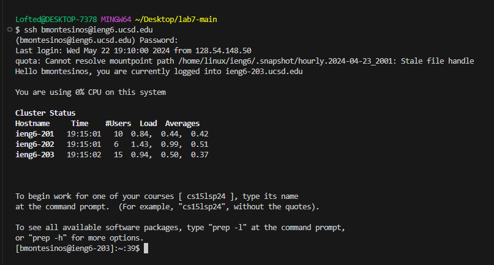
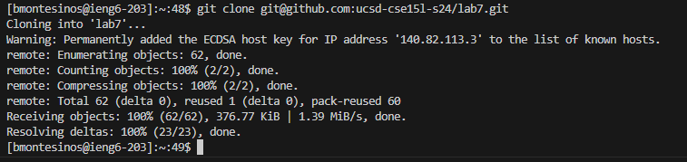
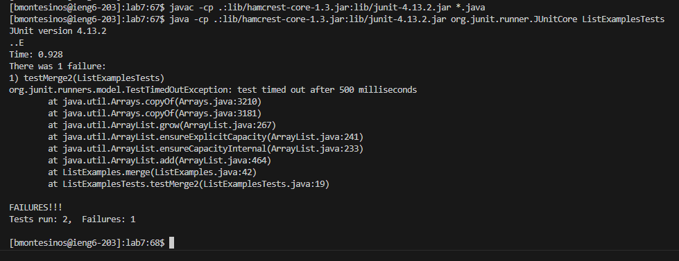
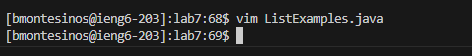
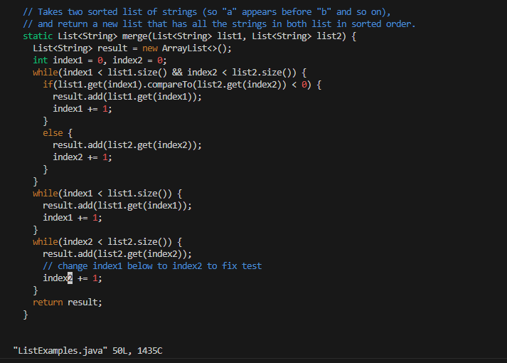
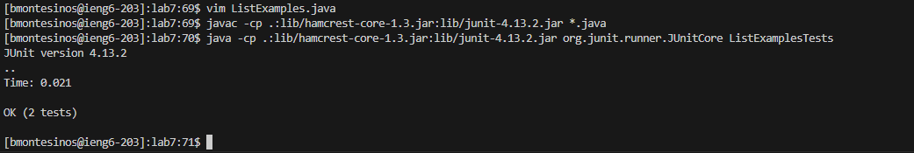
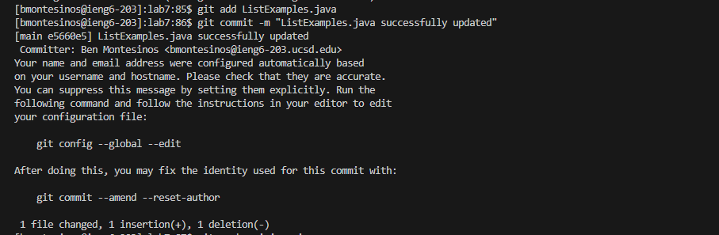
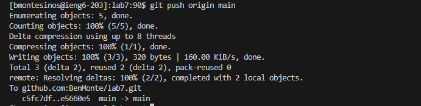
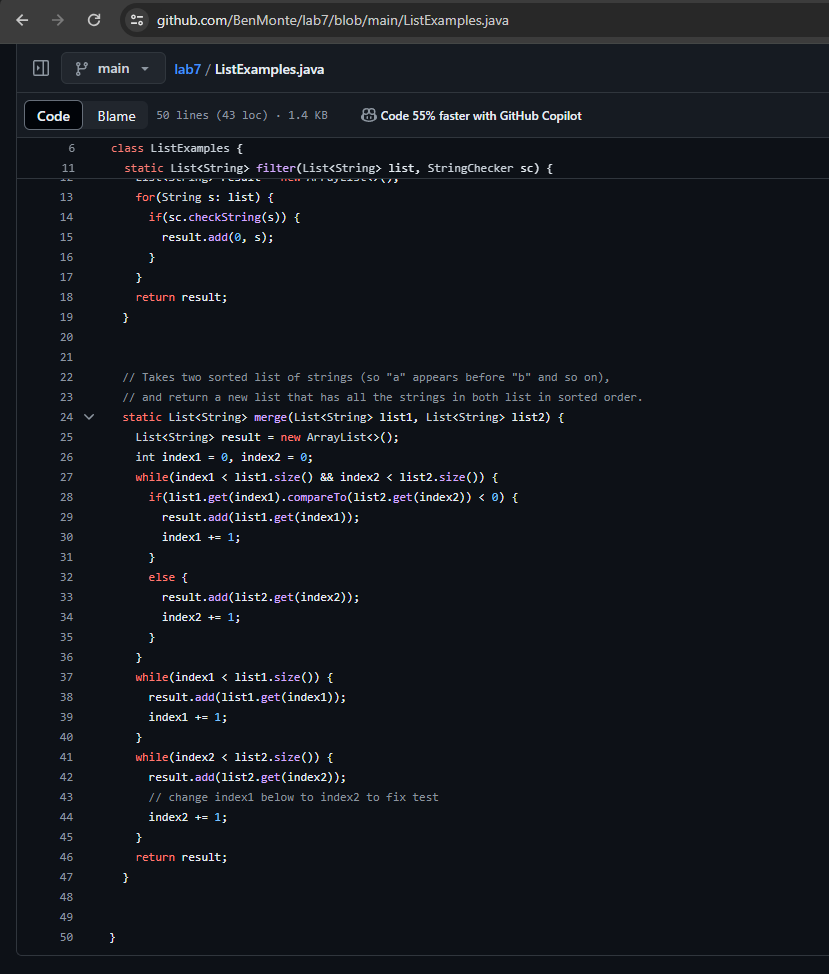

# Lab Report 4  

## 1: Logging into ieng6

To log in my ieng6 server, I opened the terminal, made sure it was in bash, and typed <ssh bmontesinos@ieng6.ucsd.edu> which logged me in instantly without needing to enter my password in. 

## 2: Cloning the forked repository from my GitHub account using the SSH URL

To do this, all I needed to do was go into my GitHub fork of the lab7 repository, click on the "<> Code" drop down menu in green, select the SSH tab, and <ctrl + c> the SSH URL to my forked repository of lab7. Then, i went into my terminal and type <git clone `git@github.com:BenMonte/lab7.git`> which cloned this repository almost instantly. 

## 3: Running Tests (fail)

To run these tests, all I did was access the test.sh file in the lab7-main folder. In this file, I located the compile text and run text. Then I selected the compile text and pressed <ctrl + c>, went into my terminal and pressed <ctrl + v> which compiled the tests. After that, I did the same thing with the run text by pressing <ctrl + c> while having it selected and then pressed <ctrl + v> into my terminal. Once that second line ran, the tests failed. 

## 4: Editing the Code

Firstly, I needed to access the file and edit it which I did by simply pressing and typing <vim 'ListExamples.java'>. Once I was in the vim editor, I used <shift> + <g> to reach end of the file where the error is occuring. Then I pressed <up> command on my keyboard 6 times to reach the line that needs change. Then, since using the <up> command brought me to the end of that line, I used the <0> command to reach the beggining of the line and then used <^> to reach the first non-blank character in the line. Since all I need to do is change the number from "1" to "2" in the first word of the line "index1", I use the <e> key to reach the last character of that word. Then, I press <a> to enter editing mode, press <backspace> and then <2> and finish off by pressing <escape> to exit th editing mode. After all that is done, all I do is type the following pressing <:wq> and then <enter> to load it and save it. 

## 5: Running Tests (pass)

To run these tests, the steps were the exact same as step 3 of running these tests where they failed. All I did was access the test.sh file in the lab7-main folder. In this file, I located the compile text and run text. Then I selected the compile text and pressed <ctrl + c>, went into my terminal and pressed <ctrl + v> which compiled the tests. After that, I did the same thing with the run text by pressing <ctrl + c> while having it selected and then pressed <ctrl + v> into my terminal. Once that second line ran, the tests passed this time. 

## 6: Commit and Push Changes

This process was a two-step execution as committing and push changes requires different commands. 

To **commit** the changes, I ran the command <git 'add ListExamples.java'> to stage the changes in this file. Then, I used the <git commit -m "ListExamples.java succesfully updated"> which was used to record the staged changes in the repository with a message of my choice describing what happened. 

To **push** these changes into my forked repository, it was quite simple as all it took was the command <git 'push origin main'> which uploads the local commits to the remote repository on GitHub. 

To show that these commands did indeed execute as intended, I attached a screenshot of the "ListExamples.java" file in my forked repository below. 

