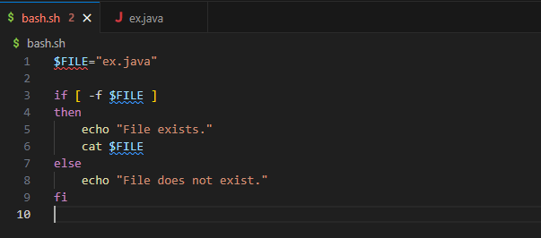
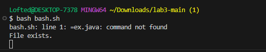
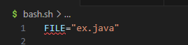
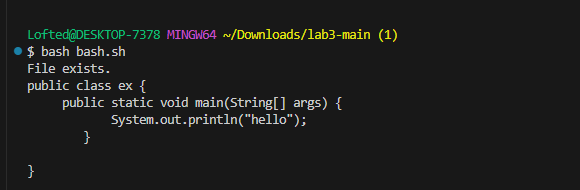

# Lab Report 5

# Part 1 - Debugging Scenario

## Bash Script Displaying Error

Hi, I wrote this bash script earlier and for some reason it won't output the file along with a message saying it exists even though everything seems correct.
My guesses are that the `cat $FILE` and `-f $FILE` commands need to have " around the `$FILE` part or the first line needs to have spaces in between FILE and = as well as a space in between = and `"ex.java"`. 
However, I tried all those fixes and still can't seem to get this code to run properly. 

Here is a screenshot of my code and the output I'm receiving:





I would really appreciate any help on this! Thanks!

## **the TA's answer**

Great question! 

You're on the right track! Does anything stand out to you about how the variable is assigned here in the very first line? Think about the syntax rules for variable assignments in bash.

Let me know if you have any further questions.

Best,
Ben

## **the student's follow-up**

Hi Ben, 

Thank you so much for your response! 
I now see what I did wrong here, it seems like the very first line of my code had an error regarding the way I assigned the FILE variable as I mistakenly put a `$` in front of it. 
The `$` character should only be used to later call that varibale in this script. 

Here is an attached screenshot of my code running succesfully!






## Setup Information

Setup Information:

File & Directory Structure:

**Directory**: /Downloads/lab3-main (1) [ ~/Downloads/lab3-main\ \(1\) ]

**Files**:
*ex.java*
*bash.sh*

**Contents of Each File Before Fixing the Bug:**

*ex.java:*

public class ex {
     public static void main(String[] args) {
            System.out.println("hello");
        }
    
}

*bash.sh:*

$FILE="ex.java" 

if [ -f $FILE ]
then
    echo "File exists."
    cat $FILE  
else
    echo "File does not exist."
fi

**Command Line to Trigger the Bug:**

```
$ bash bash.sh
bash.sh: line 1: =ex.java: command not found
File exists.
```

**Description of Necessary Edits:**

By removing the dollar sign ($) from the variable assignment, the script correctly sets FILE="ex.java". 
This change makes the condition [ -f $FILE ] work properly, allowing the script to find and display the file ex.java.


# Part 2 - Reflection


One of the most useful things I learned in the second half of this quarter was how to use `vim` for editing files from the command line. 
At first, `vim` seemed really complicated, but after doing the tutorials and working with my classmates, I got the hang of it.
Now, I can quickly navigate and edit code right in the terminal, which has made my work a lot faster and easier.


